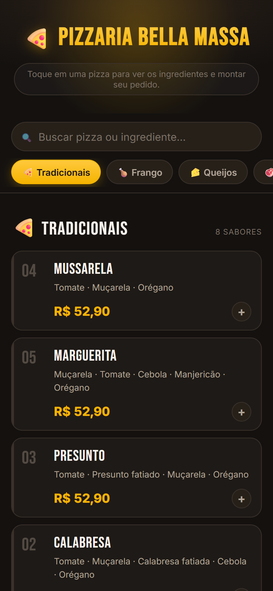
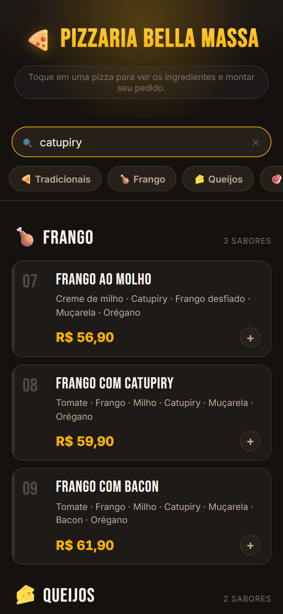
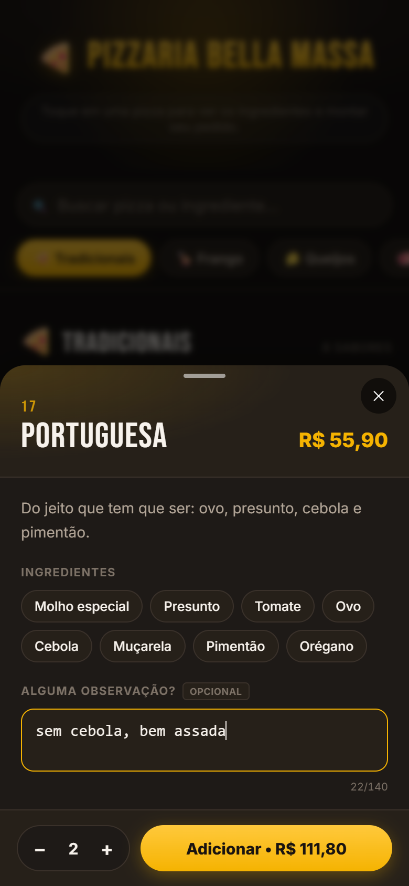
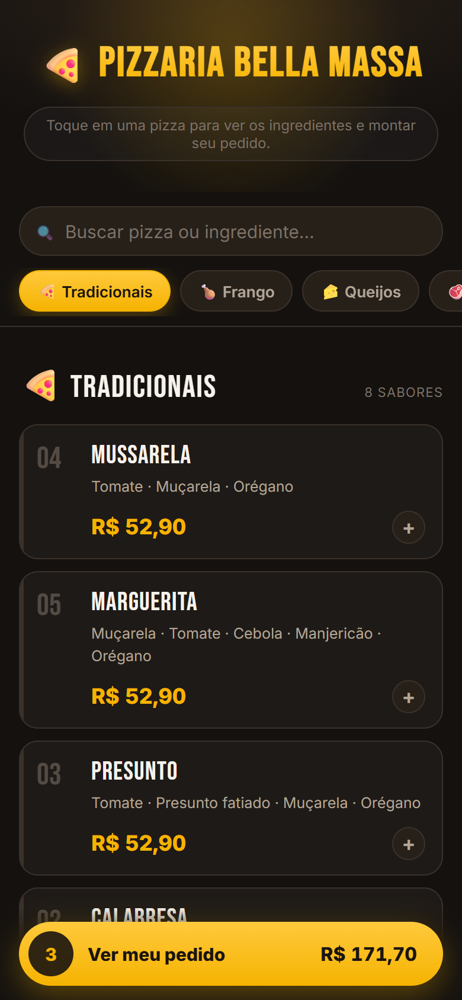
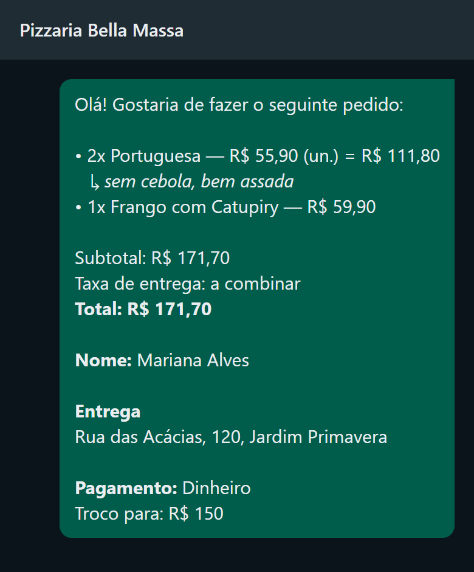
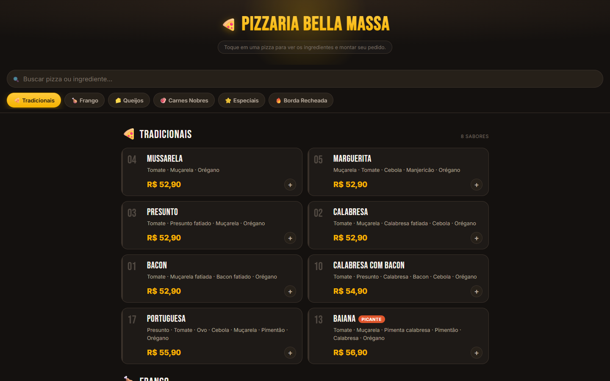
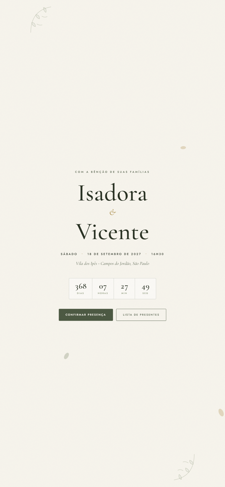
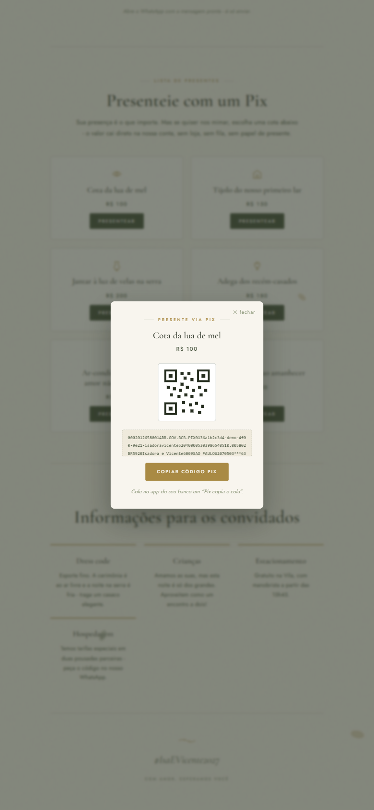

# Cardápio Digital: pedido pronto no WhatsApp

> **Código-fonte privado.** Este repositório é uma vitrine do projeto: telas, decisões
> e resultados. O código pode ser apresentado sob solicitação.

Produto que eu vendo para restaurantes e pizzarias de delivery. O cliente abre um link
no celular, monta o pedido sozinho e ele chega **pronto no WhatsApp da casa**: itens,
observações, endereço, forma de pagamento, troco e total calculado. Sem aplicativo para
baixar, sem cadastro e sem comissão por pedido.

"Pizzaria Bella Massa", com cardápio e dados de demonstração.

---

## O fluxo do pedido

<table>
  <tr>
    <td align="center"> 1. Cardápio por categorias, com número e preço de cada item</td>
    <td align="center"> 2. Busca por nome ou ingrediente, sem se importar com acentos</td>
    <td align="center"> 3. Ingredientes, quantidade e observação por item</td>
  </tr>
  <tr>
    <td align="center"> 4. Barra fixa com o total do pedido</td>
    <td align="center"> 5. Revisão do pedido, com a observação abaixo do item</td>
    <td align="center"> 6. Entrega ou retirada, pagamento e troco</td>
  </tr>
</table>

   
  7. A mensagem que chega no WhatsApp da loja (simulação com o texto real gerado pelo cardápio)

### No computador

   
  O mesmo cardápio em tela larga, com os itens em grade

---

## Extensão: convite de casamento digital

A mesma ideia aplicada a eventos. O convidado abre o convite pelo link, confirma
presença pelo WhatsApp com a mensagem pronta e escolhe uma cota da lista de presentes
via Pix. Tem contagem regressiva, programação do dia e animação de abertura.

<table>
  <tr>
    <td align="center"> Capa com contagem regressiva</td>
    <td align="center"> Lista de presentes com Pix copia e cola</td>
  </tr>
</table>

---

## Decisões de projeto

- **Sem backend.** O pedido vira um link `wa.me` com a mensagem formatada. Não há
  servidor, banco de dados nem pagamento online para manter, e o custo de operação é zero.
- **Um cliente novo em minutos.** Tudo que muda de uma loja para outra fica em um
  arquivo de configuração e em um cardápio em JSON. Os dados reais de cada cliente
  ficam fora do repositório.
- **Pensado para a hora do pico.** Mobile-first, leve o bastante para abrir em 3G e em
  celular antigo. A navegação por categorias acompanha a rolagem.
- **Conta sempre certa.** Os valores são somados em centavos inteiros, sem erro de
  ponto flutuante. A taxa de entrega pode ser fixa, grátis ou "a combinar".
- **Sem foto de banco de imagem.** O layout é tipográfico de propósito: foto genérica
  gera reclamação quando o produto chega diferente. As fotos reais entram item por item.
- **Publicação contínua.** Hospedado na Cloudflare Pages. Uma mudança de preço entra
  no ar cerca de um minuto depois do `git push`.

---

## Stack

| Parte | Tecnologias |
| --- | --- |
| **Cardápio** | React 18, Vite 5, Framer Motion, CSS próprio |
| **Convite** | HTML, CSS e JavaScript puros, sem dependências |
| **Hospedagem** | Cloudflare Pages com deploy a cada push |

---

## Contato

Desenvolvido por **Halyson Henrique**. Quer ver o código ou uma demonstração?
Entre em contato pelo [LinkedIn](https://www.linkedin.com/in/halysonhenrique/) ou pelo [GitHub](https://github.com/halysonhenrique).
